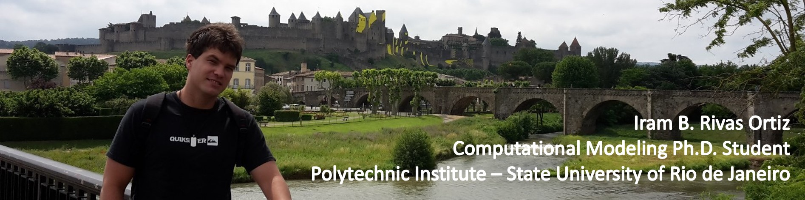

<!-- banner -->

## About
Currently working on neutron transport problems, especially by solving the discrete ordinates SN transport equations in Cartesian geometry (Reactor Physics, Nuclear Engineering). Research experience on wastewater treatment processes by using ultrasound and gamma radiation. Work experience of more than two years as assistant professor guiding undergraduate students from their first steps towards the best possible professional training.

<!-- Skills -->

- 🔭 I’m currently working on **a Matlab project**

- 🌱 I’m currently learning **web development**

- 👯 I’m looking to collaborate on **Matlab, C and Python projects**

- 🤝 I’m looking for help with **web development**

- 💬 Ask me about **Anything you like**

- ⚡ Fun fact **Always smiling and learning**

<!--Skills-->
<h3 align="left">Languages and Tools:</h3>

         

<!--Link Contacts -->

